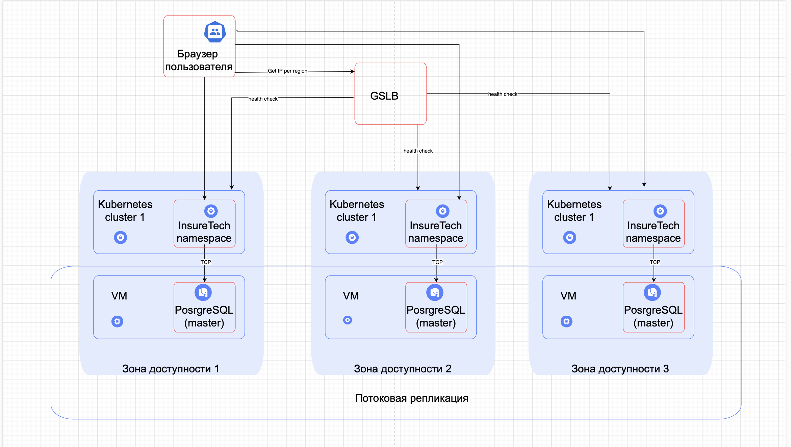

# Стратегия масштабирования

- Горизонтальная предпочтительнее вертикальной, так как с увеличение запросов не увеличиваются требования к ресурсам, затрачиваемым на один запрос.
- Предлагается использовать несколько ЦОД расположенных в разных географических регионах. Это обеспечит равное время загрузки страниц. Дополнително снизит риск глобального отказа системы из-за аварии на ЦОД. Для балансировки нагрузки применим GSLB.
- Failover стратегия active-active. В случае отказа кластера в одном реионе GSLB перенаправляет траффик на другие.

